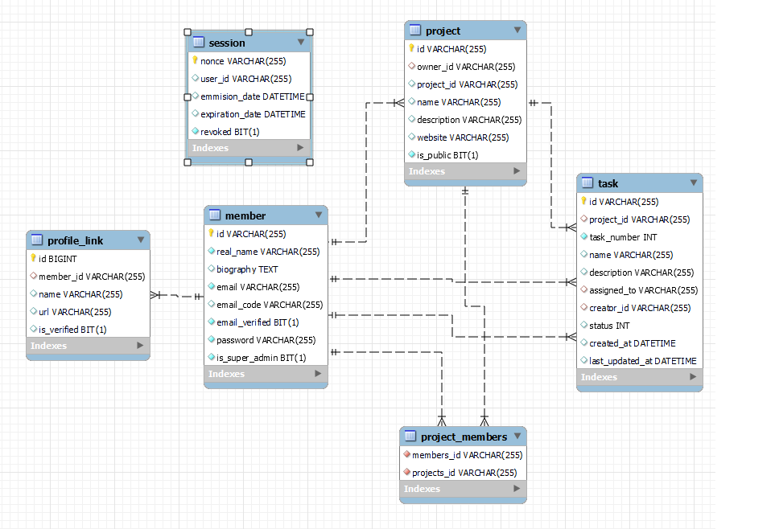
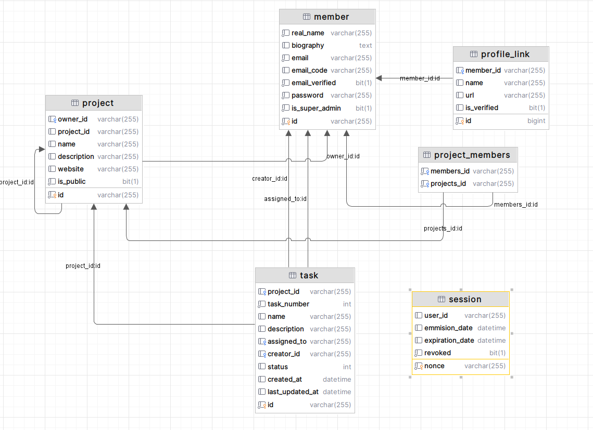

# TaskMaster

La solución definitiva para la gestión de tareas de tu equipo.

_Realizado por Adrián Barreiro, Ariel Costas y Samuel Novoa_.

## Supuesto

Tras tener que padecer aplicaciones de gestión de tareas como Trello, Asana o Jira, nos hemos dado
cuenta de que todas ellas tienen un problema en común: son demasiado complejas. No es que no sean
buenas aplicaciones, pero para un equipo pequeño, que no necesita tantas funcionalidades, resultan
demasiado complejas.

Por ello, hemos decidido crear una aplicación que sea sencilla, pero que a la vez sea útil. Para
ello, nos hemos basado en las funcionalidades que más utilizamos en las aplicaciones que hemos
mencionado anteriormente.

TaskMaster es una aplicación que permite gestionar tareas de forma sencilla. Permite crear
proyectos, añadir tareas a los proyectos, asignarlas a usuarios, cambiar su estado, etc. Como
miembro, puedes ver varios proyectos y crear los tuyos propios, sin tener que pertenecer a una
organización ni tener que ser administrador de la misma.

## Diagramas de BBDD y de clases

## Manual para desarrolladores

Ver [DEVEL.md](DEVEL.md).

## Manual para usuarios

// TODO: Añadir vídeo

## Explicación de proyecto Git

Para cada cuestión a realizar se crea una issue en el repositorio de GitHub, que se asigna a uno de
los miembros del equipo. Cuando se ha terminado la cuestión, se crea un pull request, cuya revisión
se asigna a otro miembro del equipo si se considera necesario. Para poder hacer merge, se requiere
que pasen los tests de integración continua y que se apruebe la revisión del pull request si la
hubiera.

Una vez hecho el merge, se cierra la issue automáticamente y se borra la rama de la que se ha
hecho el pull request. En main, se realiza un squash merge, para que en el historial de commits
aparezca un único commit por cada issue. Esto se hace para que el historial de commits sea más
legible.

## Propuesta de mejora

- Añadir un sistema de comentarios para las tareas.
- Añadir un sistema de etiquetas para las tareas (bug, sugerencia...).
- Añadir un sistema de notificaciones para avisar a los usuarios cuando se les asigna una tarea o
  cuando se les menciona en un comentario.
- Añadir un sistema de roles para los usuarios, para que puedan tener permisos diferentes dentro
  de un proyecto. Ya sean permisos granulares o permisos genéricos.
- Añadir un sistema de deadlines para las tareas, pudiendo establecer una fecha límite para
  completar la tarea.
- Sistema de prioridades para las tareas, computando la prioridad de una tarea en función de la
  deadline, la fecha de creación, prioridad dada manualmente, etc.
- Añadir un sistema de grupos, donde varios usuarios existen y tienen proyectos en común. Similar a
  las organizaciones de GitHub (con su propio espacio de nombres de proyectos, etc.)
- Integraciones con aplicaciones de terceros como Teams, Discord, etc.
- Integración con GitHub, GitLab y otros para poder hacer referencia a las tareas desde los
  commits.
- Soporte para autenticación empresarial con SAML o Azure AD.
- Funcionalidades premium de pago, limitando a los usuarios con cuenta gratuita a un número
  determinado de proyectos, tareas, etc.

## Conclusiones

_Adrían Barreiro_: El proyecto me ha parecido muy interesante, ya que me ha permitido aprender
muchas cosas de Spring y como funciona una aplicación web. Además, me ha permitido trabajar con dos
personas que sabian mucho y he aprendido bastante de ellos. Le hemos dedicado mucho tiempo, cerca de
40 horas, pero al final hemos conseguido un resultado bastante bueno. En cuanto a las
mejoras, creo que se podrían añadir muchas más funcionalidades, pero para un proyecto de casi un
mes, creo que hemos hecho un buen trabajo.

_Ariel Costas_: De primeras el proyecto me pareció interesante, no solo para aplicar mis
conocimientos de Spring a una aplicación real. Sin embargo, hicimos planes demasiado ambiciosos, y
la realidad nos ha impedido cumplir dichos planes. Por otra parte, este proyecto me ha permitido
aplicar mis conocimientos de DevOps (adquiridos gracias a Microsoft), pudiendo desplegar la
aplicación en Azure y configurar la integración continua con GitHub Actions. En cuanto a las
mejoras, creo que se podrían añadir muchas más funcionalidades, pero para un proyecto de
tres semanas, creo que hemos hecho un buen trabajo. Dedicación temporal: unas 30-40 horas entre
clases y en casa.

_Samuel Novoa_: Me ha gustado tratar con un framework web como Spring. A diferencia de otros
basados en node, resulta agradable contar con la robustez de un lenguaje como Java. En cuánto a
la dedicación temporal, no me fue posible disponer de todo el tiempo que hubiese deseado para
desarrollar un estilo gráfico mejor rematado, pero fue bastante intensa. El proyecto, a fin de
cuentas, tiene una envergadura para la cual nos habría hecho falta más tiempo.